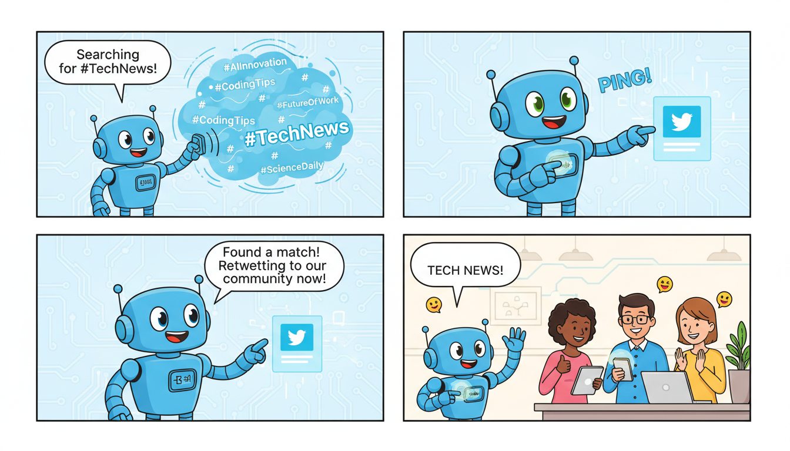

This is a comprehensive `README.md` file designed for your repository. It covers everything from setup to execution, ensuring that users (and your future self) understand how to use the bot effectively.

---

# 🤖 Twitter Bot: Retweet by Keyword

[](https://www.python.org)
[](https://www.tweepy.org/)
[](https://opensource.org/licenses/MIT)

An automated Twitter solution designed to search for real-time tweets based on specific keywords and automatically retweet them. This tool is ideal for community management, brand monitoring, or keeping a niche profile active with relevant content.

## 📌 Overview

The **Twitter Bot Retweet by Keyword** leverages the Twitter API (via the `Tweepy` library) to scan the platform for specified phrases or hashtags. When a match is found, the bot interacts with the tweet by retweeting it to your timeline. 

This repository features a Jupyter Notebook (`tweetbot_RT.ipynb`) which allows for interactive testing and data analysis of the tweets being processed.

## ✨ Features

- **Keyword Filtering:** Search for specific terms, hashtags, or phrases.
- **Automated Interaction:** Automatically retweet matching content to increase engagement.
- **Rate Limit Handling:** Built-in logic to respect Twitter's API limits.
- **Interactive Environment:** Use the provided `.ipynb` notebook to preview tweets before scaling to a full script.
- **Customizable Search:** Adjust parameters such as language, result type (popular/recent), and tweet count.

## 🛠 Prerequisites

Before running the bot, you will need:

1.  **Python 3.8+** installed on your system.
2.  **Twitter Developer Account:** You must create an app on the [Twitter Developer Portal](https://developer.twitter.com/en/docs/apps/overview) to obtain:
    - API Key & API Secret
    - Access Token & Access Token Secret
    - Bearer Token

## 🚀 Installation

1. **Clone the repository:**
   ```bash
   git clone https://github.com/your-username/data_analysis-Twitter-Bot-Retweet-by-keyword.git
   cd data_analysis-Twitter-Bot-Retweet-by-keyword
   ```

2. **Install dependencies:**
   It is recommended to use a virtual environment.
   ```bash
   pip install tweepy pandas jupyter
   ```

## ⚙️ Configuration & Usage

1. Open the `tweetbot_RT.ipynb` notebook in your preferred environment (Jupyter Lab, VS Code, or Google Colab).
2. Locate the authentication section and input your API credentials:
   ```python
   # Authentication
   consumer_key = 'YOUR_API_KEY'
   consumer_secret = 'YOUR_API_SECRET'
   access_token = 'YOUR_ACCESS_TOKEN'
   access_token_secret = 'YOUR_ACCESS_TOKEN_SECRET'
   ```
3. Set your target keywords and search parameters:
   ```python
   search_query = "#Python #DataScience -filter:retweets"
   number_of_tweets = 10
   ```
4. Run the cells to start the bot.

## 💻 Code Sample

The core logic of the bot follows this structure:

```python
import tweepy

# Initialize API
auth = tweepy.OAuthHandler(consumer_key, consumer_secret)
auth.set_access_token(access_token, access_token_secret)
api = tweepy.API(auth, wait_on_rate_limit=True)

# Keyword to search
keyword = "MachineLearning"

for tweet in tweepy.Cursor(api.search_tweets, q=keyword, lang="en").items(5):
    try:
        print(f"Found tweet by @{tweet.user.screen_name}. Retweeting...")
        tweet.retweet()
        print("Success!")
    except tweepy.TweepyException as e:
        print(f"Error: {e}")
```

## 📊 Data Analysis Potential

Since this project is structured within a Jupyter Notebook, you can easily extend the code to:
- Perform sentiment analysis on the found tweets using `TextBlob` or `VADER`.
- Store tweet metadata (likes, user location, timestamps) in a `pandas` DataFrame for later analysis.
- Visualize the frequency of keywords over time.

## ⚠️ Important Considerations

- **Twitter Rules:** Please review [Twitter's Automation Rules](https://help.twitter.com/en/rules-and-policies/twitter-automation). Excessive retweeting or spam-like behavior can result in your account being suspended.
- **API Limits:** Twitter enforces strict rate limits. Ensure `wait_on_rate_limit=True` is enabled in your Tweepy initialization.
- **Security:** Never commit your API keys directly to GitHub. Use environment variables or a `.env` file.

## 📜 License

This project is licensed under the MIT License - see the [LICENSE](LICENSE) file for details.

---
**Disclaimer:** This tool is for educational purposes. The user is responsible for any consequences resulting from the use of this bot.